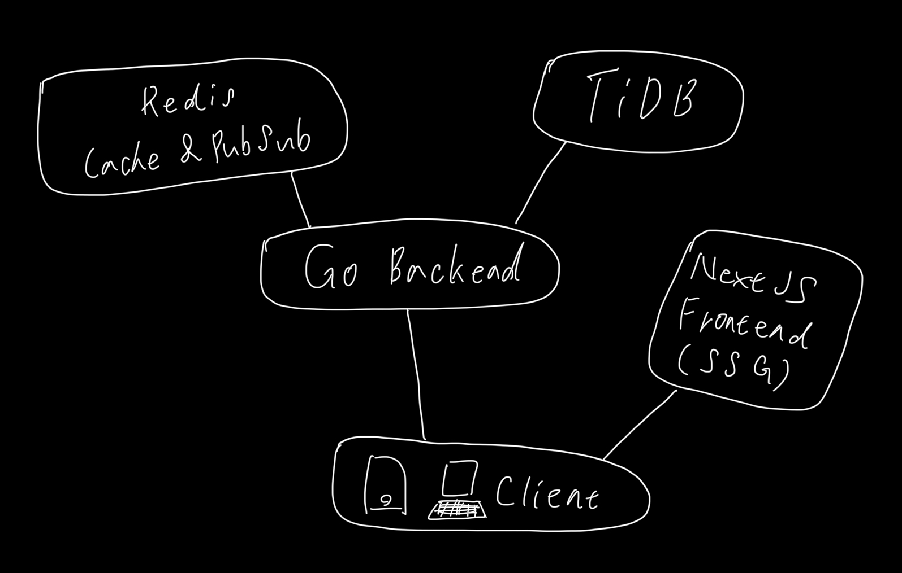
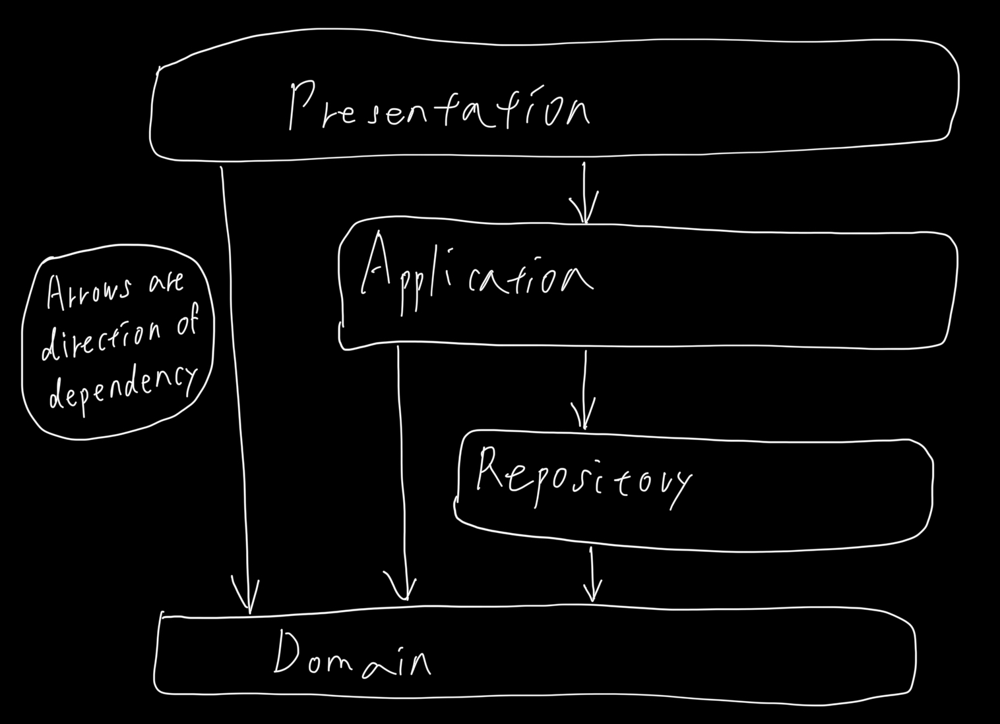

# Chat App Demo
A chat app demo built with React and Go (currently under development). This project is for educational purposes only and is not suitable for serious use.

## Features
- Backend built with Go
- Frontend built with Next.js (App Router) and React
- Real-time communication powered by Server-Sent Events and Redis PubSub
- Redis Cache for faster responses
- TiDB for infinite scalability
- Deployed on Kubernetes

## Overview

## Architecture
The frontend and backend both adopt a layered architecture inspired by DDD (Domain-Driven Design). Their respective roles are as follows.

### Backend
- **Presentation**: Handles the RESTful API server. It parses frontend requests and appropriately calls the application layer.
- **Application**: Handles business logic. Calls repository layer when connecting to external services or databases. 
- **Repository**: Connects to databases and external services. By limiting input and output to objects defined in the Domain layer, it abstracts different parameters depending on the services used.
- **Domain**: Defines the types and behaviors of the domains used in the app.

### Frontend
- **Presentation**: Handles displaying UI on user's devices using values received from application layer.
- **Application**: Handles business logic. Calls repository layer when connecting to backend api or IndexedDB. 
- **Repository**: Connects to IndexedDB or calling backend api. By limiting input and output to objects defined in the Domain layer, it abstracts different parameters depending on the services used.
- **Domain**: Defines the types and behaviors of the domains used in the app.

